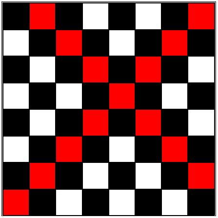

# Chess Moves Highlighter:

## Requirements:

### Must have features:
1. Show bishops, rook and queens available moves in red color.
2. Behaviour:
    - On selecting a chess piece and clicking square of board highlight the clicked and the respective chess piece's squares in red color.
3. Eg:

### Good to have features:
1. Try to refresh the board if the user clicks on some other checkbox, and then trace the path from the new checkbox.

### Approach:
- Events to handle :
    - On square click:
        -   Reset the board back to its original state and revert any previous square's background color to its original color(white/black).
        -   Store the current squares background color(white/black), id, row, and column.
        -   Access all the valid chess piece's squares, store their id's(This is useful for resetting the board to initial background colors) and change their background color to red. 

### Concepts Used:
- JS - Event Listeners | DOM Manipulations

### Solution Links:
- Codepen Link - [https://codepen.io/dsantoshkumarit/pen/yLdMXxd](https://codepen.io/dsantoshkumarit/pen/yLdMXxd).

### Optimization:
- Consider optimizations to improve the performance, like using constants for board size (e.g., 8) instead of hardcoding values.
- Additionally, encapsulate the code in an IIFE (Immediately Invoked Function Expression) to avoid global variables.