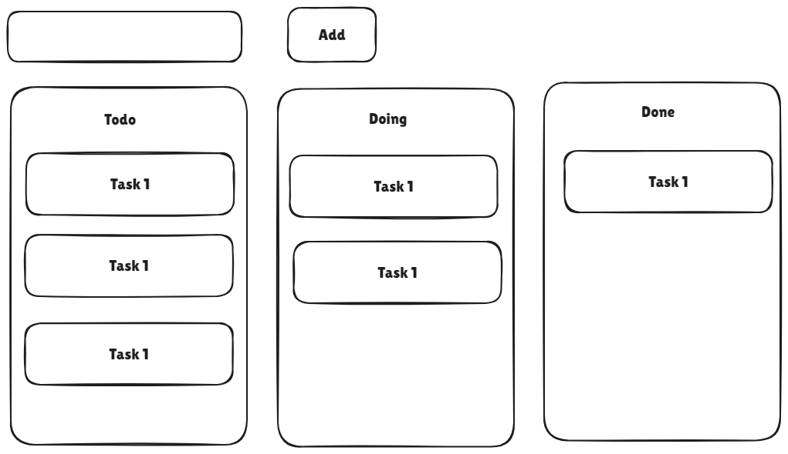

# Kan Ban Board

## Design:

## Approach:
1. On click of "Add" button 
    - We have to create a new task with unique id, "draggable = true", add the event listener for the "dragstart" and add the task in the "Todo" Section.
    - In the "dragstart" event handler we set the "id" of the task as data using "event.dataTransfer.setData("text",event.target.id)".
2. On each section which are "Todo", "Doing" and "Done" sections add the drop area having `class="section-tasks"` with the event listeners "drop" and "dragover" and assign the respective event handlers.
    - For "dragover" event we add "event.preventDefault()" which will allow us to drag and drop items.
    - For "drop" event we add "event.preventDefault()" which will allow us to drag and drop items.
        - In this we get the data set in "dragstart" by using "event.dataTransfer.getData("text")".
        - If we are dropping over an existing "task" then we add it above the target task using "event.target.insertAdjacentElement("beforebegin",document.getElementById(elementId))"
        - If we are dropping over an empty "tasks section" area then we add it at the end using "event.target.appendChild(document.getElementById(elementId))".

## Topics Learnt:
- JS - Drag and Drop API, DOM Manipulations, UUID.
- Drag and Drop API - Events - ["dragstart", "dragover", "drop"], "event.dataTransfer.setData()", "event.dataTransfer.getData()" etc.
- "event.target.insertAdjacentElement("beforebegin",document.getElementById(elementId))"

## Links:
- Codepen Link - [https://codepen.io/dsantoshkumarit/pen/KKjxOZb](https://codepen.io/dsantoshkumarit/pen/KKjxOZb)