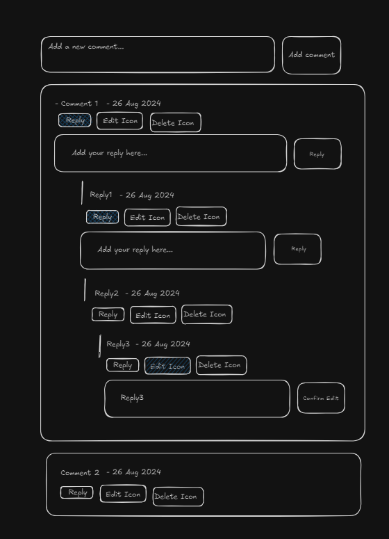

# Nested Comments:

## Wireframe:

## Requirements:

### Must have features:
1. Input field to add parallel comment section.
2. Each comment section must have a reply and delete functionality.
    - On click of reply one reply input and reply button should show which when clicked should add a new child reply section.
    - On click of delete button the comment section and all its children should be deleted.

### Good to have features:
1. Create the comment section using the object from localstorage.

### Approach:
1. Create a new comment section using "ul" and "li".
    - 1st "li" will contain the comment text and date.
    - 2nd "li" will contain the "reply" and "delete" icons.
        - "reply" icon will be given an eventlistener which when clicked will toggle an "reply input" and "reply button" section.
            - On click of the "reply button" we will add the comment as 4th "li" element in the current comment section.
        - "delete" icon will be given an eventlistener which when clicked will delete the comment section.
    - 3rd "li" will contain the "reply input" and "reply button" section which we will toggle as mentioned above.
    

### Concepts Used:
- JS - Event Listeners | DOM Manipulations | Closures
- Utilised methods like: 
    - date.toLocaleString('default', { day : "2-digit", month: 'short',year : "numeric" }) - To get "Month date, year" format.

### Solution Links:
- Codepen Link - [https://codepen.io/dsantoshkumarit/pen/YzojNyz](https://codepen.io/dsantoshkumarit/pen/YzojNyz)

### Optimization:
- NA