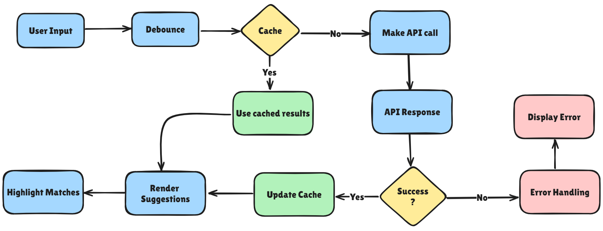

# Type Ahead / Auto Complete Component:

## Requirements:
### Must have features:
    1. Real-time Suggestions.
    2. Dynamic and static data support.
    3. Debouncing.
    4. Keyboard Navigation.
    5. Highlighted Match.
    6. Customizable.
    7. Loading Indicator.

### Good to have features:
    1. Performance.
    2. Responsiveness.
    3. Security.
    4. Caching.
    5. Accessibility.
    6. Compatibility.

### Approach:

- Events to handle :
    - click - Update the rating value and respective selected stars toggle.
    - mouseover - Highlight stars upto the last hovered star.
    - mouseleave - Stars selected should return back to previous selected rating.

### Concepts Used:
- JS - Event Bubling | Event Listeners | DOM Manipulations

### Utilities:
- Countries APIs :
    - [https://freetestapi.com/api/v1/countries](https://freetestapi.com/api/v1/countries)
    - [https://gitlab.com/restcountries/restcountries](https://gitlab.com/restcountries/restcountries)

### Solution Links:
- Codepen Link - [Codepen](https://codepen.io/dsantoshkumarit/pen/GRbQRwe)
- Reference Link - [Youtube](https://www.youtube.com/watch?v=6YrkXWFgiV8&t=30s)